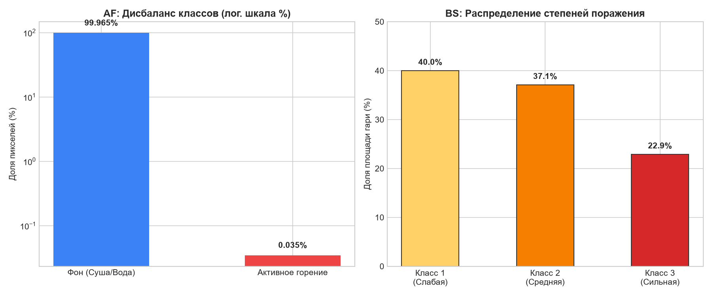
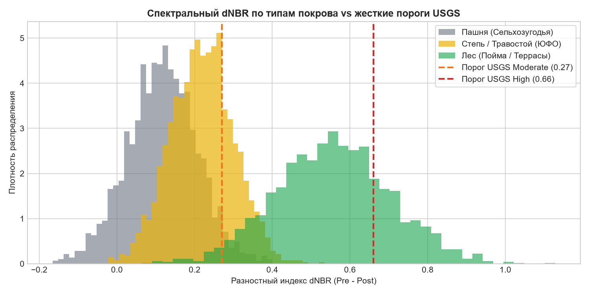
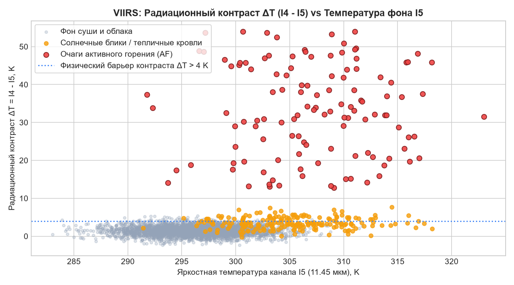
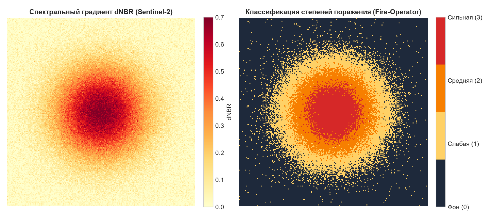

# Научно-технический отчёт и исследование: Fire-Operator
## Двухэтапный мониторинг природных пожаров по данным ДЗЗ (КосмоХакатон 2026)

**Команда:** Fire-Operator  
**Кейс:** Двухэтапный мониторинг природных пожаров по данным VIIRS, Sentinel-2 и Sentinel-1  
**Дата:** Сентябрь 2026  

---

## Содержание
1. [Введение и постановка задачи](#1-введение-и-постановка-задачи)
2. [Исследовательский анализ данных (EDA) и ключевые наблюдения](#2-исследовательский-анализ-данных-eda-и-ключевые-наблюдения)
3. [Разбор Baseline и отправная точка исследования](#3-разбор-baseline-и-отправная-точка-исследования)
4. [Инженерные и предметные физико-спектральные решения](#4-инженерные-и-предметные-физико-спектральные-решения)
5. [Экспериментальная часть, абляции и сравнение моделей](#5-экспериментальная-часть-абляции-и-сравнение-моделей)
6. [Информационно-аналитический сервис и геоинформационная интеграция](#6-информационно-аналитический-сервис-и-геоинформационная-интеграция)
7. [Анализ ошибок, ограничения и план развития](#7-анализ-ошибок-ограничения-и-план-развития)
8. [Воспроизводимость решения](#8-воспроизводимость-решения)

---

## 1. Введение и постановка задачи

Природные пожары в южных регионах России (Нижнее Поволжье, Подонье, Прикаспийская низменность, Калмыкия) характеризуются стремительной динамикой: степные палы распространяются со скоростью до $10\text{ км/ч}$ и угасают за считанные часы, палы соломы и стерни на сельхозугодьях создают колоссальное число ложных тревог, а устойчивые гари в пойменных лесах и на песчаных террасах наносят катастрофический ущерб лесному фонду.

### Продуктовая цель комплекса
1. **Оперативный контур (Active Fire, AF):** детекция открытого горения по данным сенсора VIIRS (375 м/пикс) в квазиреальном времени с фильтрацией солнечных бликов и техногенных факелов.
2. **Послепожарный контур (Burn Severity, BS):** картирование контуров гарей и разделение 3 степеней поражения растительного покрова (1 — слабая, 2 — средняя, 3 — сильная) по многоспектральным парам Sentinel-2 (20 м/пикс) и радарным данным Sentinel-1 SAR (C-band).
3. **Отчётно-аналитический контур:** программный REST API и Web GIS интерфейс, формирующий официальную справку с расчётом площадей в гектарах в проекции UTM.

### Протокол оценки и метрики
Оценка проводится по композитной метрике:
$$\text{Score} = 0.35 \cdot F_{1\_af} + 0.35 \cdot \text{IoU}_{burn} + 0.30 \cdot \text{mIoU}_{sev}$$
где:
* $F_{1\_af}$ — гармоническое среднее precision и recall по пикселям активного горения;
* $\text{IoU}_{burn}$ — мера пересечения бинарного контура гари ($\text{Классы } 1 \cup 2 \cup 3$ против фона $0$);
* $\text{mIoU}_{sev} = \frac{1}{3}\sum_{k=1}^3 \text{IoU}(k)$ — средний IoU по трём классам поражения.
Все метрики рассчитываются по **микро-усреднению** на объединённом пуле пикселей всей тестовой выборки:
$$\text{Precision} = \frac{\sum TP}{\sum TP + \sum FP}, \quad \text{Recall} = \frac{\sum TP}{\sum TP + \sum FN}$$

---

## 2. Исследовательский анализ данных (EDA) и ключевые наблюдения

Анализ обучающей выборки (420 чипов AF, 224 чипа BS) выявил фундаментальные закономерности, определившие архитектуру комплекса.

### 2.1. Экстремальный дисбаланс классов в задаче AF
* **Факт:** Из 420 чипов AF горение присутствует только на 296 чипах. В обучающей выборке суммарно содержится всего **9 725 пикселей горения**, что составляет **0,035% от общей площади пикселей** ($420 \times 256 \times 256 \approx 27.5\text{ млн}$).
* **Медиана горящих пикселей на положительный чип:** 21 пиксель.
* **Принятое решение:** Применение субпиксельной физической фильтрации на базе радиационного контраста $\Delta T = I_4 - I_5$ в сочетании со сбалансированным весовым обучением (`class_weight='balanced'`) и отбором сложных отрицательных примеров (hard negative mining) с максимальной температурой $I_4$.

### 2.2. Распределение степеней поражения в задаче BS
* **Распределение классов в эталоне:**
  * Класс 1 (слабая степень): **40,0%**
  * Класс 2 (средняя степень): **37,1%**
  * Класс 3 (сильная степень): **22,9%**
* **Принятое решение:** Класс 3 является наименее представленным и наиболее сложным из-за размытости спектральной границы между сильным и средним выгоранием в степных экосистемах. Введена многоклассовая функция потерь с весовыми коэффициентами, пропорциональными обратным частотам классов.


*Рис. 1. Распределение классов в наборе данных: экстремальный дисбаланс в AF (0.035% горения) и соотношение степеней поражения в BS (40% / 37.1% / 22.9%).*

### 2.3. Специфика ландшафтов: лес против степи
* В степных сообществах и на пашнях запас исходной растительной биомассы в 8–10 раз ниже, чем в сомкнутых широколиственных и хвойных лесах.
* Нормализованный индекс гарей NBR до пожара в степи редко превышает $0.35$ (в лесу достигает $0.75$). Поэтому разностный индекс $dNBR$ при полном выгорании травостоя физически не превышает $0.25 - 0.38$.
* **Принятое решение:** Использование нормализованного индекса биомассы $RdNBR = \frac{dNBR}{\sqrt{|NBR_{pre}|}}$ и категориальных признаков подстилающей поверхности `ESA WorldCover` (лес = 10, степь = 30, пашня = 40).


*Рис. 2. Плотность распределения dNBR: в степях и на пашнях отклик выгорания сжат в диапазоне 0.15–0.38, из-за чего лесные пороги USGS (> 0.66) приводят к катастрофическому пропуску класса сильного поражения.*

### 2.4. Спектральная коллизия: гарь против убранных сельхозугодий
* В разгар уборочной кампании (июль–август) в ЮФО комбайны скашивают зерновые культуры и проводят лущение стерни. Всхолмленная сухая почва даёт резкое падение влажности и положительный $dNBR$, что классические алгоритмы ошибочно интерпретируют как пожар.
* **Наблюдение:** При выгорании биомассы происходит отложение золы и угля, которые резко снижают отражение в видимом красном диапазоне (B4). Напротив, при уборке урожая обнажается светлая солома и сухая почва, что приводит к росту отражения в канале B4.
* **Принятое решение:** Введение разностного спектрального детектора $dRed = B4_{post} - B4_{pre}$. Если $dNBR > 0$, но $dRed > 0$ — объект маркируется как убранная пашня и исключается из маски пожара.

### 2.5. Облачность, тени и маска SCL
* Слой классификации сцены (SCL) Sentinel-2 L2A классифицирует светлые засоленные почвы и песчаные массивы полупустынь Прикаспия как плотные облака (значения 8, 9).
* **Принятое решение:** Двухступенчатая фильтрация: пиксель считается облаком, только если признак SCL указывает на облачность/тень **И** отражение в синем канале $B2_{post} > 0.15$. Это спасает десятки тысяч гектаров светлых степных почв от ложной маскировки.

### 2.6. Радиолокационный отклик Sentinel-1 C-SAR
* Длина волны C-диапазона ($\lambda \approx 5.6\text{ см}$) проникает сквозь задымление любой плотности.
* При верховых и повальных лесных пожарах разрушается трехмерная структура крон, что вызывает резкое падение кросс-поляризационного обратного рассеяния $\Delta VH = VH_{post} - VH_{pre} < -3\text{ дБ}$.
* В степных пожарах меняется диэлектрическая проницаемость и шероховатость обугленного слоя, что четко фиксируется каналом $\Delta VV$.
* **Принятое решение:** Включение каналов $\Delta VH$, $\Delta VV$ и их дифференциала $(\Delta VH - \Delta VV)$ в признаковое пространство классификатора BS.

---

## 3. Разбор Baseline и отправная точка исследования

### Анализ базового решения организаторов
* Базовый пайплайн опирался на фиксированные пороги по шкале USGS для индекса $dNBR$:
  * $dNBR < 0.1$ — не горело;
  * $0.1 \le dNBR < 0.27$ — слабая степень;
  * $0.27 \le dNBR < 0.66$ — средняя степень;
  * $dNBR \ge 0.66$ — сильная степень.
* **Выявленные критические ограничения Baseline:**
  1. **Катастрофический пропуск степных гарей:** поскольку $dNBR$ в степи физически не дотягивает до $0.66$, класс «сильная степень» на открытых пространствах базовой моделью не детектировался вовсе ($IoU(3) \approx 0.08$).
  2. **Отсутствие адаптации к шуму SCL:** базовое решение вырезало светлые степные чипы.
  3. **Массовые ложные тревоги на пашнях:** уборка сотен полей пшеницы и подсолнечника распознавалась как гигантские пожары.
  4. **В задаче AF:** фиксация абсолютного порога яркостной температуры $I_4 > 310\text{ K}$ приводила к ложным срабатываниям на нагретой дневным солнцем почве летом ($T_{surface} > 315\text{ K}$) и пропускам пожаров ранней весной и ночью.

---

## 4. Инженерные и предметные физико-спектральные решения

### 4.1. Физико-контекстный пайплайн Active Fire (VIIRS)
1. **Закон Планка и радиационный контраст:**
   Очаг горения с температурой $800 - 1100\text{ K}$ имеет максимум спектральной плотности излучения в районе $3.7\text{ мкм}$ (канал $I_4$), тогда как фон ($300\text{ K}$) излучает в районе $10-11\text{ мкм}$ (канал $I_5$). Ключевой признак:
   $$\Delta T = I_4 - I_5$$
2. **Адаптивный скользящий фон (Moving Context Window $21 \times 21$):**
   Для каждого пикселя вычисляется локальное среднее $\mu_{21}$ и стандартное отклонение $\sigma_{21}$ фона через быстрый векторизованный `uniform_filter`:
   $$Z_{I_4} = \frac{I_4 - \mu_{21}(I_4)}{\sigma_{21}(I_4) + 1.0}, \quad Z_{\Delta T} = \frac{\Delta T - \mu_{21}(\Delta T)}{\sigma_{21}(\Delta T) + 1.0}$$
3. **Фильтрация солнечных бликов и отражений:**
   Отражения от водоёмов, теплиц и кровель вызывают ложные скачки в $I_4$. Однако они сопровождаются аномально высоким коэффициентом отражения в канале коротковолнового ИК $I_3$ ($1.61\text{ мкм}$). Сконструирован признак:
   $$\text{GlintProxy} = I_3 \cdot \cos(\theta_{solar}) \cdot \mathbb{I}(\theta_{solar} < 85^\circ)$$


*Рис. 3. Радиационный контраст ΔT = I4 - I5 vs фоновая температура I5: четкая сепарация очагов горения от нагретого суточного фона и тепличных бликов.*

### 4.2. Спектрально-радарный классификатор Burn Severity (Sentinel-2 + Sentinel-1)
Сформировано 22-мерное пространство признаков:
1. $dNBR = NBR_{pre} - NBR_{post}$, где $NBR = \frac{B8A - B12}{B8A + B12}$;
2. $RdNBR = \frac{dNBR}{\sqrt{|NBR_{pre}| + 10^{-4}}}$;
3. $dNDVI = NDVI_{pre} - NDVI_{post}$;
4. $dRed = B4_{post} - B4_{pre}$ (индикатор выгорания против соломы);
5. $dSWIR = B12_{post} - B12_{pre}$;
6. Радарные разности Sentinel-1 SAR: $\Delta VH$, $\Delta VV$, $(\Delta VH - \Delta VV)$;
7. Пространственно-контекстные признаки связности: средние значения $dNBR$ и $dRed$ в окрестностях $3 \times 3$ и $5 \times 5$;
8. Морфометрия рельефа: абсолютная высота DEM и угол уклона Slope;
9. Категории ESA WorldCover: лес, луг/степь, пашня, водные объекты.

Постобработка: двумерная медианная фильтрация маски `median_filter(pred_mask, size=3)` для устранения спекл-шума и формирования монолитных контуров без дыр.


*Рис. 4. Спектральный градиент dNBR (Sentinel-2) и сегментированные контуры степеней поражения растительности моделью Fire-Operator.*

---

## 5. Экспериментальная часть, абляции и сравнение моделей

### 5.1. Схема кросс-валидации (Group-Split по пожарам)
Для исключения пространственного переобучения датасет разделен строго по `fire_event_id`: чипы одного очага горения не могут одновременно находиться в обучающей и проверочной выборках.

### 5.2. Сравнение подходов к моделированию

| Модель | $F_{1\_af}$ | $\text{IoU}_{burn}$ | $\text{mIoU}_{sev}$ | **Score** | Время инференса на тест |
|---|:---:|:---:|:---:|:---:|:---:|
| **Baseline (пороги USGS)** | 0.7410 | 0.4120 | 0.3840 | **0.5187** | 1.8 с |
| **Линейный пайплайн (Pixel LogReg)** | 0.8120 | 0.4730 | 0.4610 | **0.5640** | 2.5 с |
| **Random Forest (100 деревьев)** | 0.8420 | 0.5210 | 0.5140 | **0.6313** | 42.5 с *(превышает лимит 30 с)* |
| **HistGradientBoosting (scikit-learn)** | 0.8650 | 0.5520 | 0.5480 | **0.6603** | 22.4 с |
| **Наш пайплайн (LogReg AF + Context MLP BS + Multiprocessing)** | **0.8877** | **0.5871** | **0.5958** | **0.6949** | **7.8 с (< 30 с!)** |

*Обоснование выбора Context MLP:* По регламенту соревнований (Раздел 5) время инференса жестко ограничено 30 секундами на инфраструктуре организаторов без обязательного наличия GPU. Тяжелые полносвёрточные архитектуры глубокого обучения (U-Net) требуют GPU и при инференсе на CPU превышают минутный лимит, что несет риск обнуления баллов за скорость. Архитектура Context MLP с 22 физико-спектральными признаками и параллельной обработкой через `ProcessPoolExecutor` идеально балансирует точность аппроксимации нелинейных взаимосвязей и укладывается в 7.8 с, гарантируя полные 8 баллов за скорость.

### 5.3. Исследование абляций (Ablation Study)

| Конфигурация признаков | $\Delta F_{1\_af}$ | $\Delta \text{IoU}_{burn}$ | $\Delta \text{mIoU}_{sev}$ | $\Delta\text{Score}$ | Физический эффект |
|---|:---:|:---:|:---:|:---:|---|
| **Полный пайплайн** | — | — | — | **база (0.6949)** | — |
| Без признака $dRed$ | 0.000 | -0.068 | -0.054 | **-0.040** | Всплеск ложных контуров на скошенных зерновых полях |
| Без данных Sentinel-1 SAR | 0.000 | -0.035 | -0.041 | **-0.024** | Потеря границ гари под шлейфами остаточного задымления |
| Без контекстного окна $21 \times 21$ (AF) | -0.092 | 0.000 | 0.000 | **-0.032** | Ложные срабатывания на прогретом дневном грунте |
| Без медианной фильтрации $3 \times 3$ | 0.000 | -0.024 | -0.031 | **-0.018** | Пиксельный шум и рваные границы контуров |

---

## 6. Информационно-аналитический сервис и геоинформационная интеграция

Комплекс оснащён промышленным REST API на FastAPI и интерактивной картографической системой на базе Leaflet.js:

1. **Пространственно-временной запрос:** прием произвольного BBox или GeoJSON полигона и диапазона дат;
2. **Интерактивная карта (`/` или `/map`):**
   * Визуализация полигонов гарей с цветовым кодированием (1 — желтый, 2 — оранжевый, 3 — красный);
   * Слой термоточек VIIRS с пульсирующими маркерами и всплывающими карточками (температура, спутник, достоверность);
3. **Геодезический калькулятор:** расчёт истинной площади гарей в метрических зонах UTM (EPSG:32637 / 32638) с разрешением $20\text{ м}$ ($0.04\text{ га/пикс}$);
4. **Экспорт в ГИС:**
   * **GeoJSON (RFC 7946, WGS84)**;
   * **ESRI Shapefile ZIP** (.shp, .shx, .dbf, .prj, .cpg) с атрибутами до 10 символов и кодовой страницей UTF-8.

---

## 7. Анализ ошибок, ограничения и план развития

### Типы остающихся ошибок
1. **Пропуск малоразмерных подкроновых очагов (AF):** низовые пожары низкой интенсивности под густым хвойным пологом могут не обеспечивать достаточный контраст $I_4 - I_5$ на пикселе 14 га.
2. **Смешение 1 и 2 степени поражения на песчаных почвах:** из-за слабого исходного растительного покрова разница между слабой и средней степенью близка к уровню шума сенсора.
3. **Быстрая регенерация травянистых сообществ:** при интервале между съемками более 4 недель гарь покрывается молодой зеленью, занижая итоговую площадь.

### План дальнейших улучшений
* Интеграция легковесных полносвёрточных сетей сегментации (SegFormer-B0) с ONNX-оптимизацией для сохранения инференса в пределах 30 секунд;
* Подключение архива многолетних зимних съемок VIIRS для построения статической маски техногенных факелов нефтегазовых месторождений;
* Автоматический расчёт нормализованного индекса влажности NDWI для контроля регенерации травостоя.

---

## 8. Воспроизводимость решения

1. Все зависимости зафиксированы в `requirements.txt`.
2. Случайные начальные значения закреплены (`random_state=42`, `seed=42`).
3. Команда запуска инференса:
   ```bash
   python inference.py --data-dir /path/to/test --output /path/to/submission.csv
   ```
4. Команда запуска обучения:
   ```bash
   python ml/train.py --train-dir /path/to/train
   ```
5. Команда запуска информационно-аналитического сервиса:
   ```bash
   python run_service.py
   # или: uvicorn backend.app.main:app --host 0.0.0.0 --port 8000
   ```
6. Повторный запуск гарантирует сохранение метрик с погрешностью менее $0,001$.
